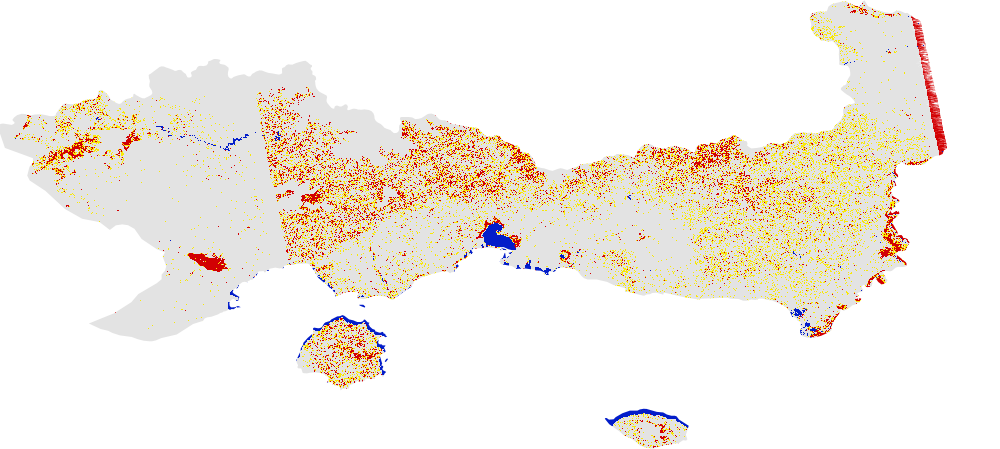
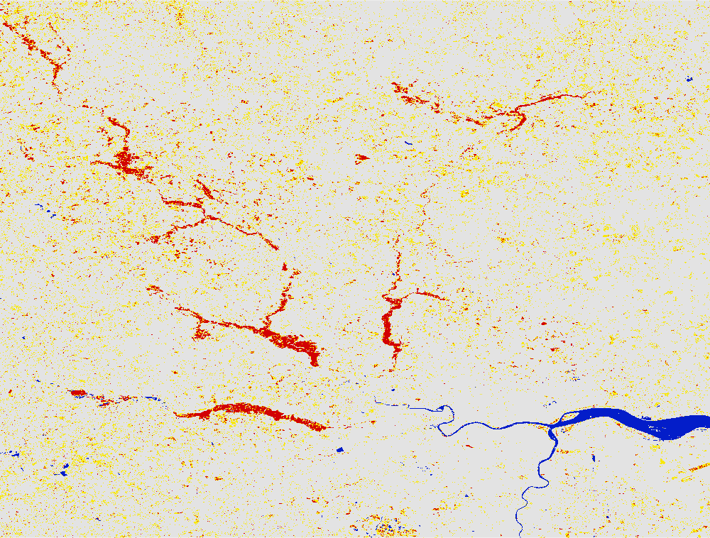

# Floods in the year 2015 mapped using Global Flood Mapper 

## 2015 Anatoliki Makedonia Kai Thraki, Greece 
Country: Greece 
State: Anatoliki Makedonia Kai Thraki - one has to zoom in to the west of Sığırcı Lake to map the flood extent as shown in image below. 
Pre flood date: 01 Mar 2016 + 30 days (since Jan and Feb 2015 also had some amount of water and Sentinel was not available before that period, it is okay to take a time period after the flood inundation has drained. Because in principle, a time stretch with no flood water is required for reference.) 
During flood date: 12 Mar 2015 + 0 days 
Asc/Desc: Ascending 
Max slope: 1 
URL: https://gfm-updates.projects.earthengine.app/view/globalfloodmapper-v2#pfd0=2016-03-01;pfd1=2016-03-31;dfd0=2015-03-12;dfd1=2015-03-12;sd0=30;sd1=0;state=Anatoliki%20Makedonia%20Kai%20Thraki;country=Greece;zvv=-3;zvh=-3;pow=75;pass=Ascending;elev=900;slp=1; 

 
 

## 2015 England, U.K. of Great Britain and North Ireland 
Country: U.K. of Great Britain and North Ireland 
State: England - one has to zoom to the extent between York and Selby to map the flood extent as shown in image below. 
Pre flood date: 01 Oct 2015 + 30 days   (Too many scene with edges in Nov and Dec.)
During flood date: 29 Dec 2015 + 0 days 
Asc/Desc: Descending 
URL: https://gfm-updates.projects.earthengine.app/view/globalfloodmapper-v2#pfd0=2015-10-01;pfd1=2015-10-31;dfd0=2015-12-29;dfd1=2015-12-29;sd0=30;sd1=0;llat=53.53;llong=-1.53;rlat=54.34;rlong=-0.45;zvv=-3;zvh=-3;pow=75;pass=Descending;elev=900;slp=3; 

 
 

