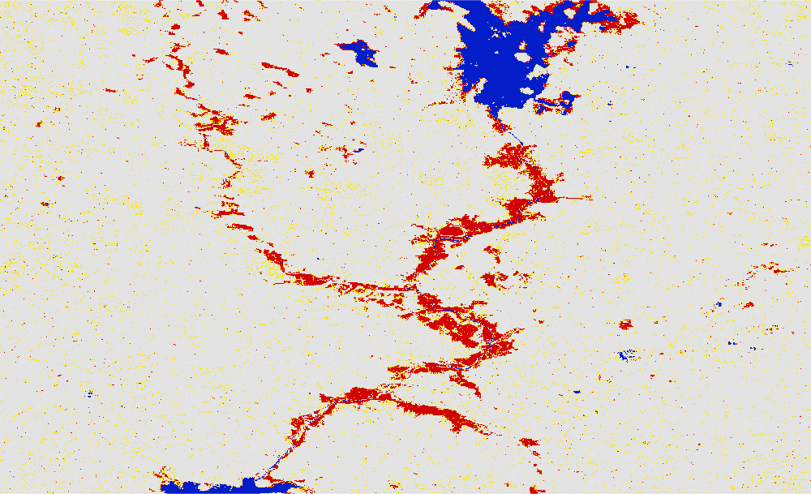

# Floods in the year 2016 mapped using Global Flood Mapper 

## 2016 Roscommon, Ireland 
Country: Ireland 
State: Roscommon - flood water is along the Shannon river. One has to zoom in to the south of Lough Lake to map the flood extent as shown in image below. 
Pre flood date: 01 Oct 2015 + 30 days 
During flood date: 09 Jan 2016 + 0 days 
Asc/Desc: Ascending 
Max slope: 1 
URL: https://gfm-updates.projects.earthengine.app/view/globalfloodmapper-v2#pfd0=2015-10-01;pfd1=2015-10-31;dfd0=2016-01-09;dfd1=2016-01-09;sd0=30;sd1=0;llat=53.07;llong=-8.47;rlat=53.57;rlong=-7.65;zvv=-3;zvh=-3;pow=75;pass=Ascending;elev=900;slp=1; 

 
 

