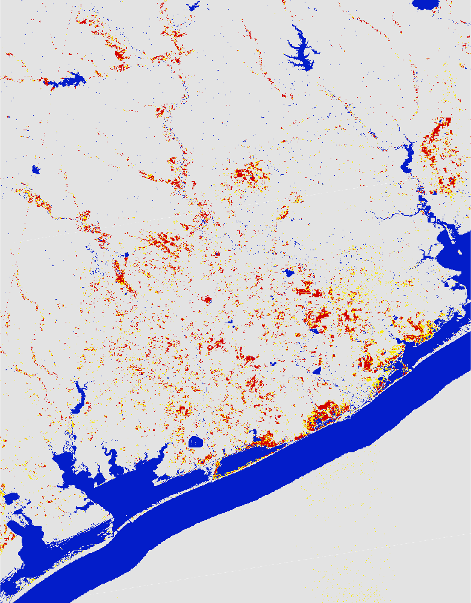
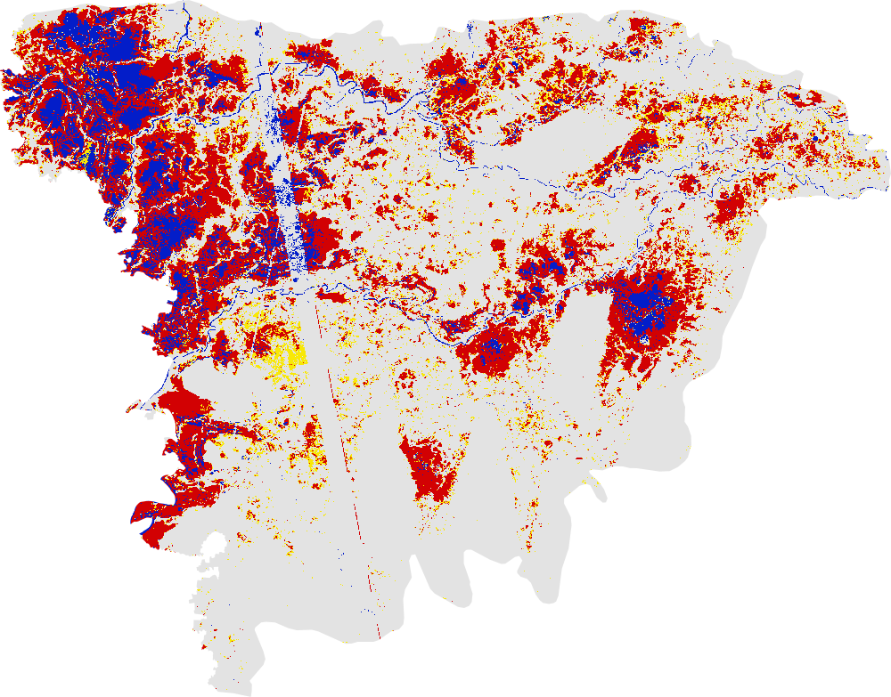

# Floods in the year 2017 mapped using Global Flood Mapper

## 2017 Houston, USA 
Country: United States of America 
State: Texas - since Texas is tool large and exceeds GEE user limit, one has to zoom in to the south of Bay City to map the flood extent as shown in image below. 
Pre flood date: 01 Jun 2017 + 60 days 
During flood date: 29 Aug 2017 + 0 days 
URL: https://gfm-updates.projects.earthengine.app/view/globalfloodmapper-v2#pfd0=2017-06-01;pfd1=2017-07-31;dfd0=2017-08-29;dfd1=2017-08-29;sd0=60;sd1=0;llat=28.08;llong=-96.89;rlat=30.66;rlong=-94.87;zvv=-3;zvh=-3;pow=75;pass=Combined;elev=900;slp=15; 

 
 

## 2017 Sylhet, Bangladesh 
Country: Bangladesh 
State: Sylhet - flood extent is not captured by any one polygon of the GAUL, one has to zoom out a bit map the flood extent as shown in image below. 
Pre flood date: 01 Feb 2017 + 60 days 
During flood date: 05 Aug 2017 + 10 days 
URL: https://gfm-updates.projects.earthengine.app/view/globalfloodmapper-v2#pfd0=2017-02-01;pfd1=2017-04-02;dfd0=2017-08-05;dfd1=2017-08-15;sd0=60;sd1=10;state=Sylhet;country=Bangladesh;zvv=-3;zvh=-3;pow=75;pass=Combined;elev=900;slp=15; 

 
 
