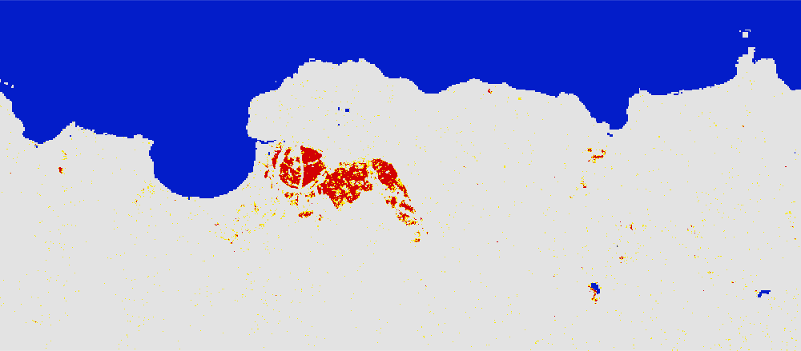
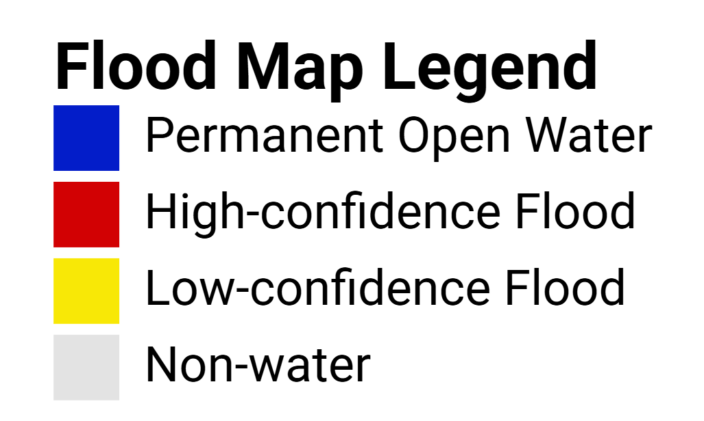

# Floods in the year 2018 mapped using Global Flood Mapper

## 2018 Hawaii, USA 
Country: United States of America 
State: Hawaii (Kauai)  
Pre flood date: 01 Feb 2018 + 60 days 
During flood date: 15 April 2018 + 0 days 
URL: https://gfm-updates.projects.earthengine.app/view/globalfloodmapper-v2#pfd0=2018-02-01;pfd1=2018-04-02;dfd0=2018-04-15;dfd1=2018-04-15;sd0=60;sd1=0;llat=22.17;llong=-159.55;rlat=22.24;rlong=-159.39;zvv=-3;zvh=-3;pow=75;pass=Combined;elev=900;slp=15; 
 
 
