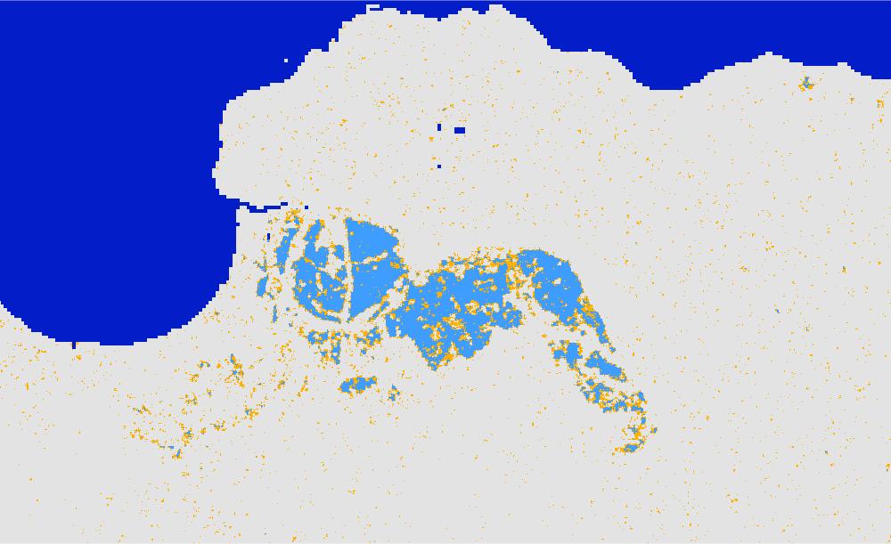

# Following are a few examples of the Global Flood Mapper portal

## 2018 Hawaii, USA 
Country: United States of America 
State: Hawaii 
Pre flood date: 01 Feb 2018 + 60 days 
During flood date: 15 April 2018 + 0 days 
 
 

