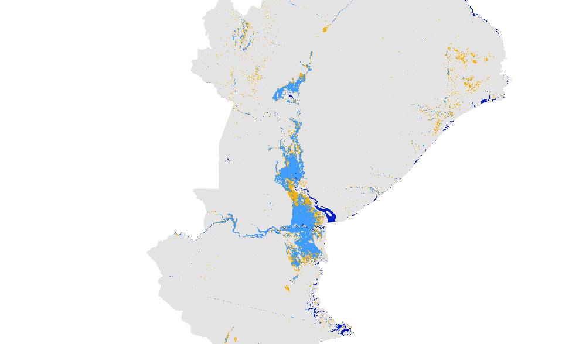
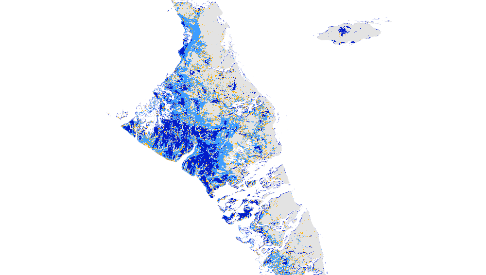

# Floods in the year 2019 mapped using Global Flood Mapper

## 2019 Assam, India 
Country: India 
State: Assam 
Pre flood date: 01 May 2019 + 45 days 
During flood date: 04 July 2019 + 10 days 
 
 

## 2019 Beira, Mozambique 
Country: Mozambique 
State: Sofala 
Pre flood date: 01 Jan 2019 + 60 days 
During flood date: 19 Mar 2019 + 1 day 
 
 

## 2019 Bahamas 
Country: Bahamas 
State: Default 
Pre flood date: 01 Jun 2019 + 60 days 
During flood date: 03 Sep 2019 + 5 days 
 
 
