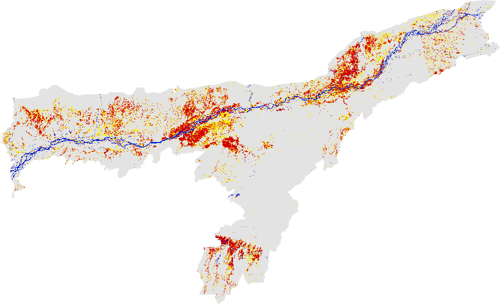
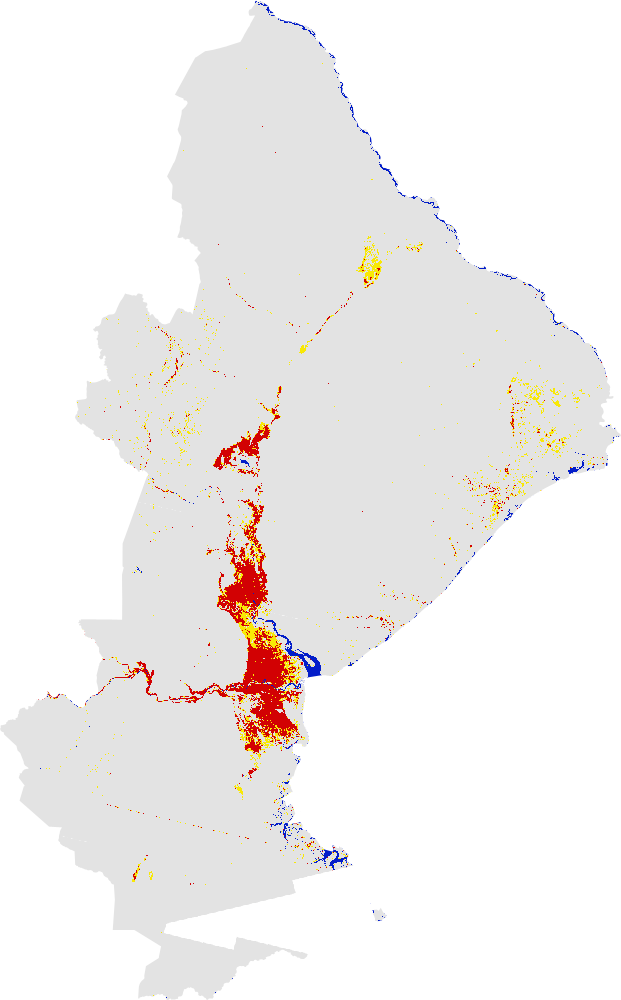
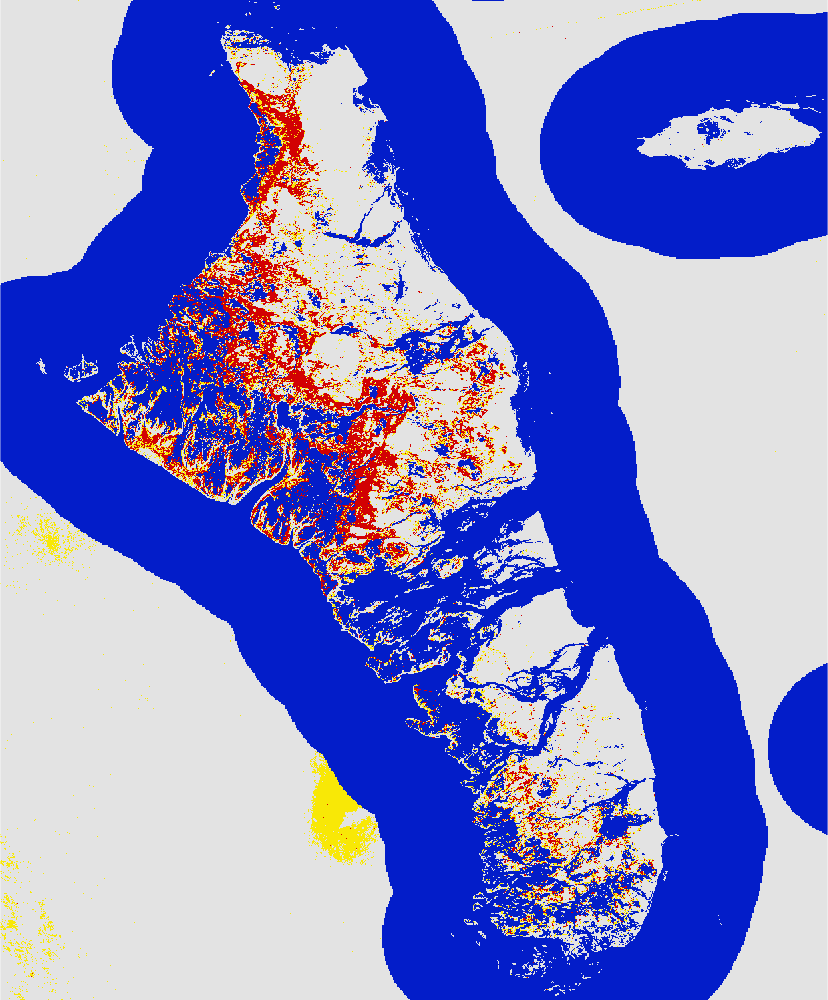

# Floods in the year 2019 mapped using Global Flood Mapper

## 2019 Assam, India 
Country: India 
State: Assam 
Pre flood date: 01 May 2019 + 45 days 
During flood date: 04 July 2019 + 10 days 
URL: https://gfm-updates.projects.earthengine.app/view/globalfloodmapper-v2#pfd0=2019-05-01;pfd1=2019-06-15;dfd0=2019-07-04;dfd1=2019-07-14;sd0=45;sd1=10;state=Assam;country=India;zvv=-3;zvh=-3;pow=75;pass=Combined;elev=900;slp=15; 

 
 

## 2019 Beira, Mozambique 
Country: Mozambique 
State: Sofala 
Pre flood date: 01 Jan 2019 + 60 days 
During flood date: 19 Mar 2019 + 1 day 
URL: https://gfm-updates.projects.earthengine.app/view/globalfloodmapper-v2#pfd0=2019-01-01;pfd1=2019-03-02;dfd0=2019-03-19;dfd1=2019-03-20;sd0=60;sd1=1;state=Sofala;country=Mozambique;zvv=-3;zvh=-3;pow=75;pass=Combined;elev=900;slp=15; 

 
 

## 2019 Bahamas 
Country: Bahamas 
State: Default 
Pre flood date: 01 Jun 2019 + 60 days 
During flood date: 03 Sep 2019 + 5 days 
URL: https://gfm-updates.projects.earthengine.app/view/globalfloodmapper-v2#pfd0=2019-06-01;pfd1=2019-07-31;dfd0=2019-09-03;dfd1=2019-09-08;sd0=60;sd1=5;llat=23.63;llong=-78.59;rlat=25.25;rlong=-77.24;zvv=-3;zvh=-3;pow=75;pass=Combined;elev=900;slp=15; 
 
 
