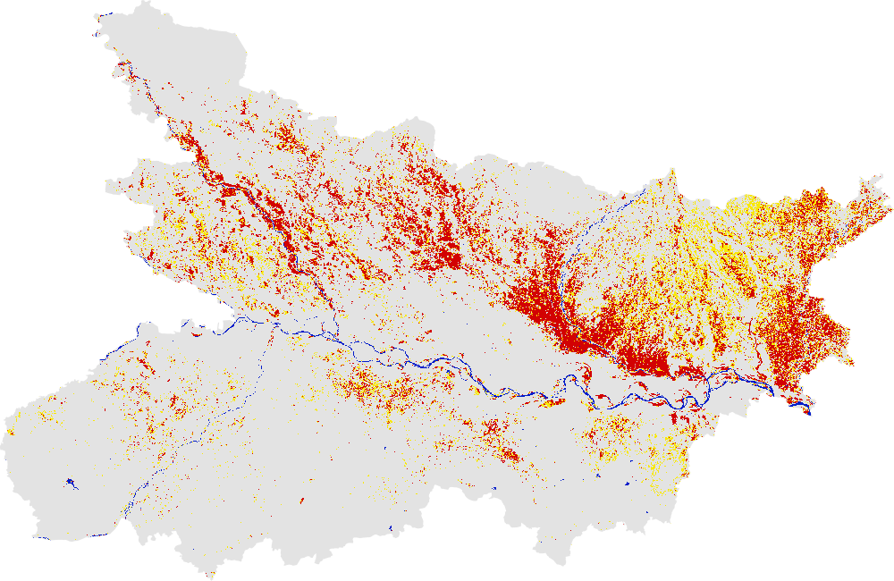
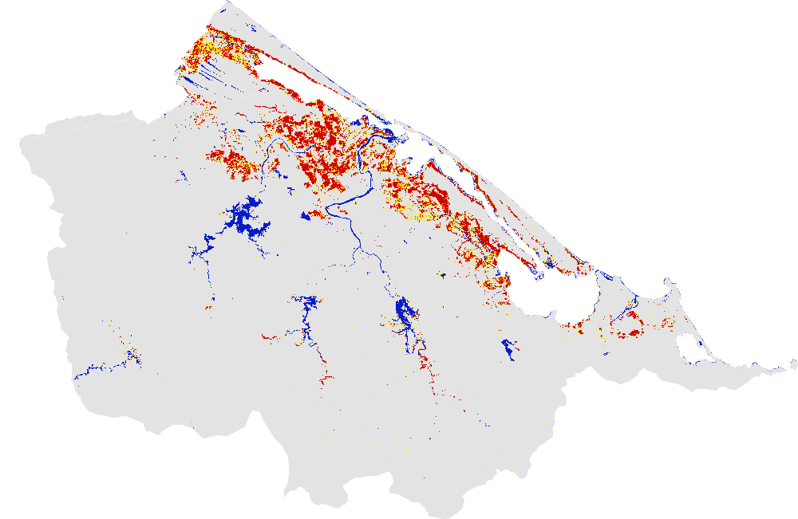

# Floods in the year 2020 mapped using Global Flood Mapper

## 2020 Bihar, India 
Country: India 
State: Bihar 
Pre flood date: 01 May 2020 + 60 days 
During flood date: 20 July 2020 + 8 days 
URL: https://gfm-updates.projects.earthengine.app/view/globalfloodmapper-v2#pfd0=2020-05-01;pfd1=2020-06-30;dfd0=2020-07-20;dfd1=2020-07-28;sd0=60;sd1=8;state=Bihar;country=India;zvv=-3;zvh=-3;pow=75;pass=Combined;elev=900;slp=15; 

 
 

## 2020 Huế, Vietnam 
Country: Viet Nam 
State: Thua Thien - Hue 
Pre flood date: 01 Aug 2020 + 60 days 
During flood date: 13 Oct 2020 + 1 day 
URL: https://gfm-updates.projects.earthengine.app/view/globalfloodmapper-v2#pfd0=2020-08-01;pfd1=2020-09-30;dfd0=2020-10-13;dfd1=2020-10-14;sd0=60;sd1=1;state=Thua%20Thien%20-%20Hue;country=Viet%20Nam;zvv=-3;zvh=-3;pow=75;pass=Combined;elev=900;slp=15; 

 
 

## 2020 Cambodia 
Country: Cambodia 
State: Manual extent 
Pre flood date: 01 Apr 2020 + 60 days 
During flood date: 17 Oct 2020 + 8 days 
URL: https://gfm-updates.projects.earthengine.app/view/globalfloodmapper-v2#pfd0=2020-04-01;pfd1=2020-05-31;dfd0=2020-10-17;dfd1=2020-10-25;sd0=60;sd1=8;llat=9.90;llong=102.02;rlat=13.95;rlong=106.49;zvv=-3;zvh=-3;pow=75;pass=Combined;elev=900;slp=15; 

 
 
