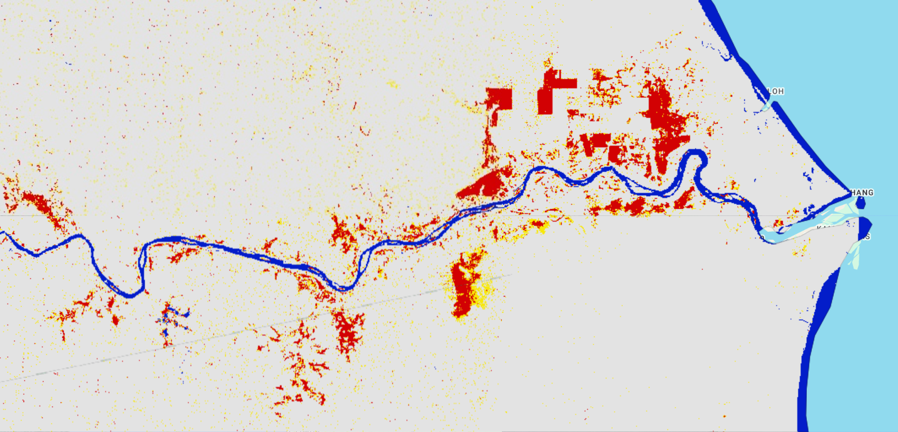

# Floods in the year 2021 mapped using Global Flood Mapper

## 2021 Pahang, Malaysia 
Country: Malaysia 
State: Pahang - one can zoom a bit near the coast along the Pahang river and check the "Current map extent" checkbox to map the flood extent as shown in image below. 
Pre flood date: 01 Nov 2020 + 60 days 
During flood date: 13 Jan 2021 + 1 days 
URL: https://gfm-updates.projects.earthengine.app/view/globalfloodmapper-v2#pfd0=2020-11-01;pfd1=2020-12-31;dfd0=2021-01-13;dfd1=2021-01-14;sd0=60;sd1=1;llat=3.32;llong=102.70;rlat=3.70;rlong=103.50;zvv=-3;zvh=-3;pow=75;pass=Combined;elev=900;slp=15;  

 
 

