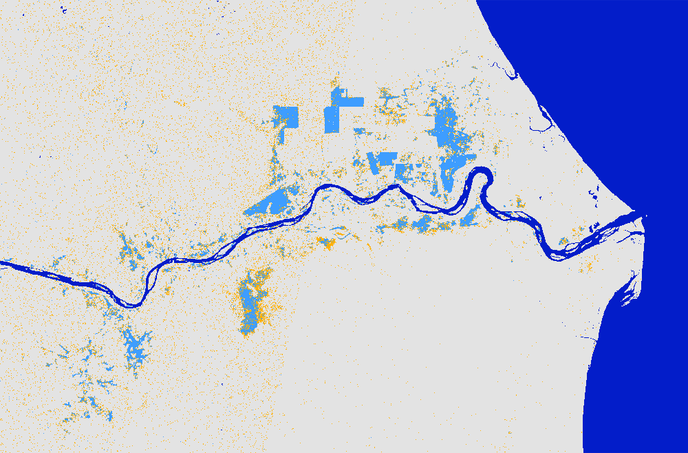

# Floods in the year 2021 mapped using Global Flood Mapper

## 2021 Pahang, Malaysia 
Country: Malaysia 
State: Pahang - one can zoom a bit near the coast along the Pahang river and check the "Current map extent" checkbox to map the flood extent as shown in image below. 
Pre flood date: 01 Nov 2020 + 60 days 
During flood date: 13 Jan 2021 + 1 days 
 
 

