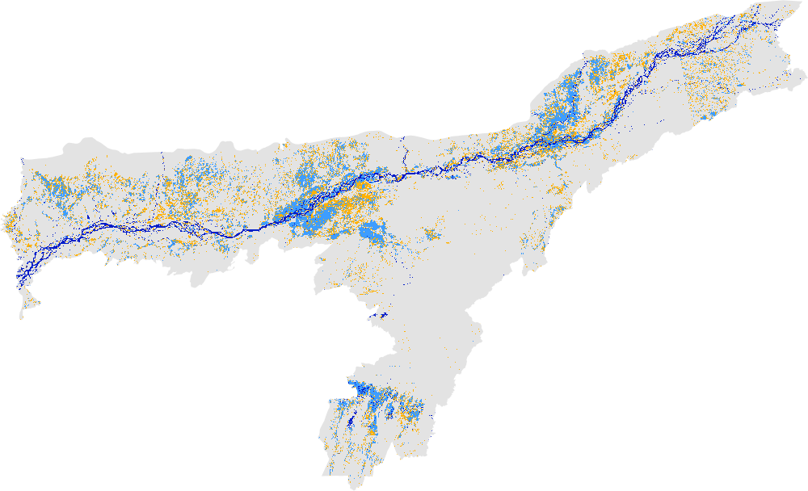
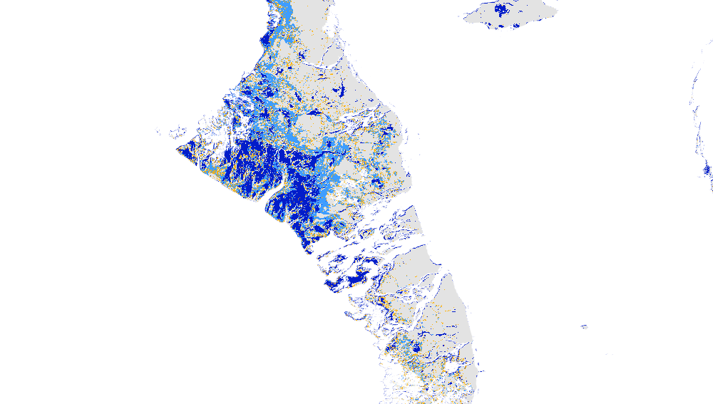
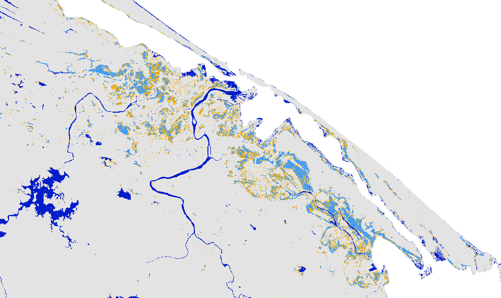

# Following are a few examples of the Global Flood Mapper

## 2020 Bihar, India 
Country: India 
State: Bihar 
Pre flood date: 01 May 2020 + 60 days 
During flood date: 20 July 2020 + 8 days 
 
 

## 2019 Assam, India 
Country: India 
State: Assam 
Pre flood date: 01 May 2019 + 45 days 
During flood date: 04 July 2019 + 10 days 
 
 

## 2019 Beira, Mozambique 
Country: Mozambique 
State: Sofala 
Pre flood date: 01 Jan 2019 + 60 days 
During flood date: 19 Mar 2019 + 1 day 
 
 

## 2019 Bahamas 
Country: Bahamas 
State: Default 
Pre flood date: 01 Jun 2019 + 60 days 
During flood date: 03 Sep 2019 + 5 days 
 
 

## 2020 Huế, Vietnam 
Country: Viet Nam 
State: Thua Thien - Hue 
Pre flood date: 01 Aug 2020 + 60 days 
During flood date: 13 Oct 2020 + 1 day 
 
 
