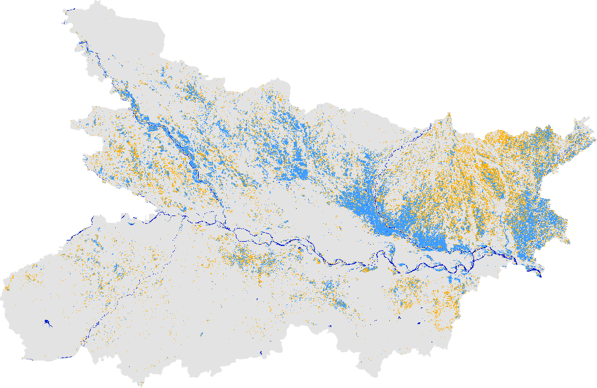
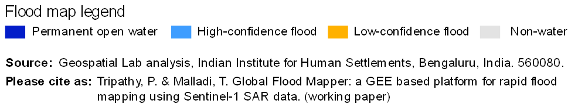

# Following are a few examples of the Global Flood Mapper

## 1. 2020 Bihar, India 
Country: India 
Area: Bihar 
Pre flood date: 01 May 2020 + 60 days 
During flood date: 20 July 2020 + 8 days 
 
 
