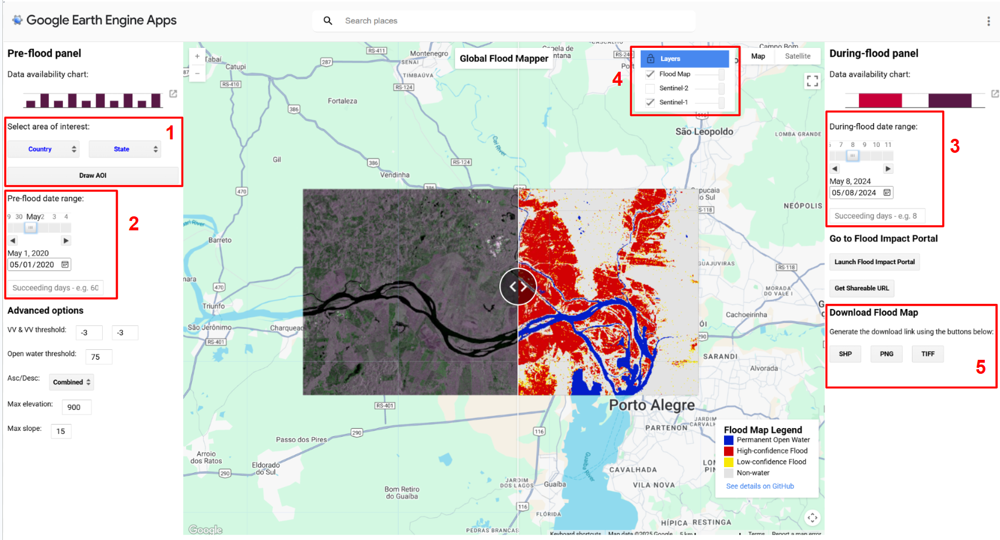
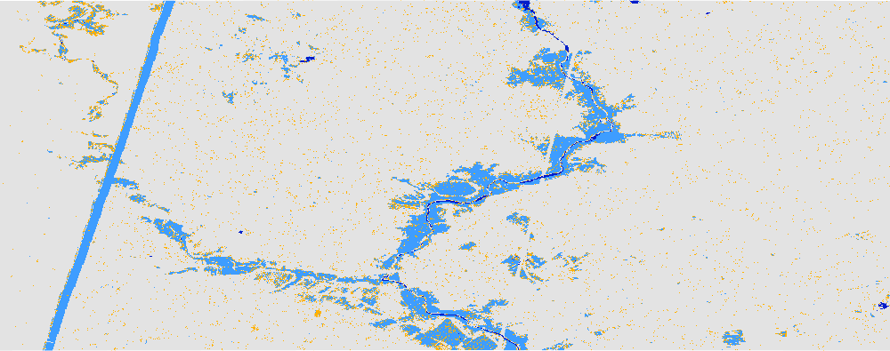
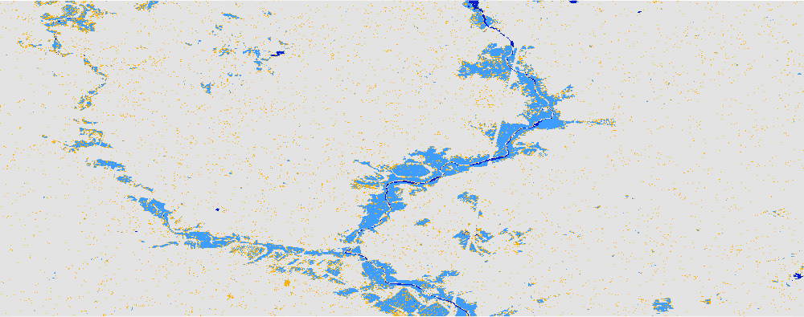

# Recommended steps to generate the flood map:  

1. Select the area of interest (AOI) for flood mapping. This can be done in two ways. 1) Select the country and state from the dropdown menu. 2) Draw a custom AOI by clicking the "Draw AOI" button.  
2. Select a date range of approximately one to two months before the floods. This is done with the pre-flood start date slider and the associated textbox for the number of succeeding days (defaults to 60).  
3. With some rough idea about the flood dates, select a date range. This should be the minimum number of days required to cover the area. The minimum number of scenes required to wholly cover an area should be determined by a test-and-trial approach, by trying out different values for the 'succeeding days' field.  
4. Switch off the flood map from the layers dropdown and toggle between the pre-flood image and the during-flood image using the slider in the center. Test a few values for the during-flood date range and finalize one that shows the most difference visually while toggling. Water/sand appears dark in color, but a change in black from the pre-flood image and during-flood image will only represent new water. Once finalized, turn on the flood map layer.  
5. Click on the download button to get the flood extent as a TIFF, SHP, or PNG file.  

## Advanced options  

6. The VV and VH thresholds can be tweaked, both default to -3. Increasing it to -2 or -1, etc. will result in a lot more cells in the flood category.   
7. The valid range for the permanent open water (POW) threshold is 0 through 100, which defaults to 75. This can be tweaked to get desirable flood map.  
8. If the area of interest (AOI) is small enough and is covered by a single 'during-flood' scene, the orbit pass direction of that scene should be selected from the drop-down menu for best results. For large AOIs, if the flood inundation water stagnates for a small period, Ascending and Descending passes should be combined. In case inundated water stays for long enough duration and multiple images of different passes are available, the images of Ascending and Descending passes can be processed separately, which is the ideal way. All these four options are present in the drop down menu.  
9. On comparing the flood map with the Google Earth basemap and Sentinel-1 raw images, if flood class pixels are found on hills/valleys (most likely to result from combining the Ascending and Descending passes), the maximum elevation and slope allowed for the flood pixels can be reduced. The elevation and slope default to 900m and 15 degrees respectively.

## Common Mistakes  

1. If you see linear flood extent (like a proper line). It is most likely the edge of a SAR scene in the during-flood image. In such a case please try to select any other date near the first one. For e.g. the [Roscommon, Ireland 2016](../examples/2016) flood in the examples, a during-flood stretch of 09 to 11 Jan 2016 gave a linear feature, which I avoided by selecting 09 Jan 2016 as the during-flood date. 

	 
 
